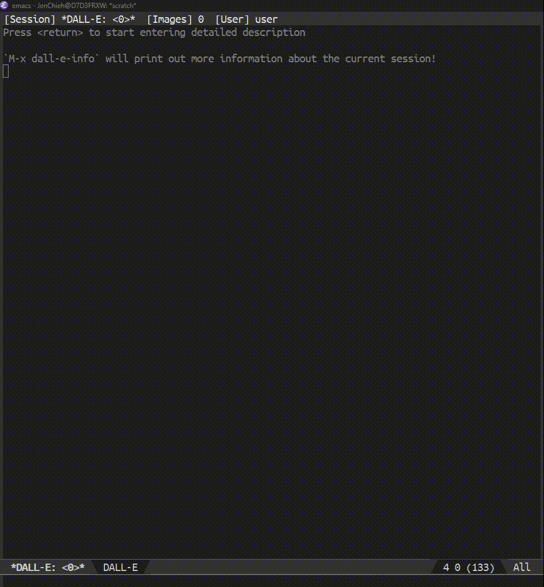

[](https://www.gnu.org/licenses/gpl-3.0)
[](https://jcs-emacs.github.io/jcs-elpa/#/dall-e)

# dall-e
Use DALL-E inside Emacs

[](https://github.com/emacs-openai/dall-e/actions/workflows/test.yml)

<p align="center">

</p>

## 💾 Installation

#### package.el

This package is available from [JCS-ELPA](https://jcs-emacs.github.io/jcs-elpa/).
Install from these repositories then you should be good to go!

Normally, you don't need to add `(require 'dall-e)` to your configuration since
most `'dall-e` commands are autoload and can be called without loading the module!

#### use-package

If you are using [use-package](https://www.emacswiki.org/emacs/UsePackage),
add the following to your `init.el` file:

```elisp
(use-package dall-e :ensure t)
```

or with `straight.el`:

```elisp
(use-package dall-e
  :straight (dall-e :type git :host github :repo "emacs-openai/dall-e"))
```

#### Manual installation

Copy all `.el` files in this repository to `~/.emacs.d/lisp` and add the following:

```elisp
(add-to-list 'load-path "~/.emacs.d/lisp/")
(require 'dall-e)
```

## 🔑 Obtaining API key

To use this extension, you will need an API key from OpenAI. To obtain one,
follow these steps:

1. Go to [OpenAI's website](https://beta.openai.com/account/api-keys). If you
don't have an account, you will need to create one or sign up using your Google
or Microsoft account.
2. Click on the `Create new secret key` button.
3. Copy the key and paste into the 'API Key' field under the 'openai' custom group settings.

When you create a new account, you receive $18 in free credits for the API which
you must use in the first 90 days. You can see pricing information
[here](https://openai.com/api/pricing/). 1000 tokens are about 700 words, and
you can see the token count for each request at the end of the response in the
sidebar.

## 🔨 Usage

To start this package:

```
M-x dall-e
```

## 📝 Customization

#### 🧪 Variables

- `dall-e-n` - The number of images to generate.  Must be between 1 and 10. (Default: `5`)
- `dall-e-size` - The size of the generated images. (Default: `"256x256"`)
- `dall-e-spinner-type` - The type of the spinner. (Default: `'moon`)
- `dall-e-cache-dir` - Absolute path to download image files.
- `dall-e-display-width` - The image size to display in buffer. (Default: `200`)

## 🔗 References

- [chatgpt-shell](https://github.com/xenodium/chatgpt-shell)

## Contribute

[](http://makeapullrequest.com)
[](https://github.com/bbatsov/emacs-lisp-style-guide)
[](https://www.paypal.me/jcs090218)
[](https://www.patreon.com/jcs090218)

If you would like to contribute to this project, you may either
clone and make pull requests to this repository. Or you can
clone the project and establish your own branch of this tool.
Any methods are welcome!
